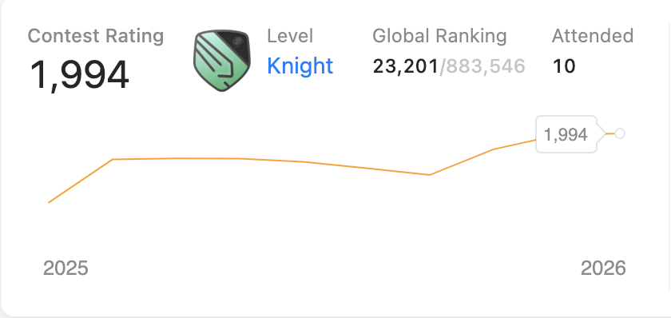

# 💻 James Nithil V | Developer Portfolio & Systems Dashboard

🚀 **Live Portfolio**: [jamesnithil.vercel.app](https://jamesnithil.vercel.app)  
📄 **Resume**: [Download James Nithil Resume (PDF)](./James_Nithil_Resume.pdf)  
🧠 **LeetCode**: [leetcode.com/u/NITHIL07](https://leetcode.com/u/NITHIL07/) (Knight Rating 1,994, Rank #197 / 43,027)  
💼 **LinkedIn**: [linkedin.com/in/jamesnithil-v](https://www.linkedin.com/in/jamesnithil-v)  
🌐 **GitHub**: [github.com/nithiljn](https://github.com/nithiljn)  

---

## 👨‍💻 About Me

Software Developer at **Vaken Technology**, engineering enterprise backend services and REST APIs for the **Sovablu low-code platform** using **Java 21, Spring Boot, Redis, PostgreSQL**, and **AWS Bedrock**. Concurrently architecting **KadalVazhi** as an independent engineering initiative, an enterprise-grade real-time maritime microservices and AI platform built with **Java 25, Apache Kafka, Python FastAPI**, and **LangGraph**.

---

## 🏆 Key Achievements

- **LeetCode Knight Badge**: Contest Rating **1,994** | Global Ranking **23,201 / 883,546** | Contests Attended: **10**
- **Weekly Contest 490**: Global Rank **#197 out of 43,027** participants (Solved 4/4 problems with 100% accuracy).
- **LeetCode Problem Solving Breakdown**:
  - **Total Solved**: 707 unique problems
  - **Java**: 446 problems solved (Trees, Graphs, BFS/DFS, Dynamic Programming, Recursion, Two Pointers, Greedy, Linked Lists)
  - **Python3**: 443 problems solved (Algorithmic problem solving and data structures)
  - **MySQL**: 40 problems solved (Relational database queries and optimization)
  - **C++**: 31 problems solved
  - **Pandas**: 16 problems solved (Data analysis and transformation)
  - **JavaScript**: 13 problems solved
  - **Python**: 5 problems solved
  - **Bash**: 1 problem solved
  - **Core Topic Mastery**: Dynamic Programming (108), Math (136), Hash Table (133), Arrays (380), Strings (161), Sorting (90), Greedy (66)
- **Smart India Hackathon (SIH)**: Team Leader of a 5-member team designing AI agriculture advisory prototypes.

  

---

## 💼 Work Experience

### **Junior Software Developer** at Vaken Technology (Product: Sovablu)
*Aug 2025 to Present | On-site, Trichy, Tamil Nadu, India*
- Built and maintained production **REST APIs** using **Java and Spring Boot**, applied rate limiting, **Singleton design pattern**, and scalable system design for high-availability workflows.
- Integrated **Redis caching** at critical hotspots, reducing database query latency, and stored structured business data in **PostgreSQL**.
- Managed **CI/CD deployment pipelines via Jenkins** (JAR build and deploy), utilizing **AWS CodeCommit, EC2, S3, and Lambda** for cloud infrastructure.
- Engineered an **Agentic AI system** using **AWS Bedrock** for LLM API calls, and built **OCR pipelines in Python** to extract data from images, PDFs, and documents.
- Developed frontend features in **Vue.js** and configured CORS and proxy layers for secure client-server communication.

---

## 🚀 Featured Projects

### 🌊 **KadalVazhi (கடல் வழி): Maritime Microservices & AI Platform (2026)**
*Repository: [github.com/orgs/kadal-vazhi/repositories](https://github.com/orgs/kadal-vazhi/repositories) (Under Active Development)*
- **Polyglot Microservices**: Core transactional services engineered in **Java 25 and Spring Boot** (`nn-home-service`, `fleet-service`, `crew-exchange-service`, `marketplace-service`) routed via **Spring Cloud Gateway**, using **Apache Kafka** event streaming for asynchronous workflows.
- **Offline-First Deep-Sea Sync**: Solved 5-to-10 nautical mile offshore dead zones using local SQLite / Room storage with idempotent background sync to PostgreSQL once vessels reach coastal 4G networks.
- **Direct-From-Sea Pre-Order Marketplace**: Enables dockside catch declarations at sea, linking vessel arrival ETAs at major fish landing centers (Kasimedu, Tuticorin, Rameswaram) directly to buyers and eliminating exploitative middlemen.
- **Voyage Ledger & Subsidized Fuel Quota**: Full voyage lifecycle engine for all vessel classes (country craft to 15-day trawlers), tracking diesel/kerosene subsidies, ice supplies, crew rosters, and trip P&L.
- **Emergency Crew Exchange & AI Voice Advisory**: Rapid crew replacement board paired with a **Python FastAPI AI Voice Engine** using Whisper STT (Tamil/Malayalam) and LLM marine safety reasoning.
- **DevOps & Cloud**: Containerized on **AWS EKS Kubernetes** with Application Load Balancers, Multi-AZ RDS PostgreSQL (JSONB), and automated canary deployments via **Jenkins CI/CD**.

### 🎙️ **AI InterviewBot: Dynamic Voice Interviewer**
- Autonomous voice-based interview assistant conducting live conversational interviews.
- Analyzes candidate verbal responses dynamically and provides constructive feedback without resume bias.
- *Tech Stack*: Python, Flask, Gemini API, gTTS, ElevenLabs API.

### 🏥 **SymptoMedAI: Disease Prediction and Healthcare Assistant**
- Predicts medical conditions from structured symptom inputs using machine learning algorithms.
- Features automated appointment booking, medicine suggestions, and physician consultation workflow.
- *Tech Stack*: Python, Random Forest, FastAPI, Flask, MySQL.

### 🌾 **FarmVista: Smart Agriculture Advisory**
- AI agriculture platform predicting optimal crop selection and fertilizer schedules based on real-time weather and soil health data.
- *Tech Stack*: Python, Machine Learning, Flask, Weather API, Soil Analysis.

---

## 🛠️ Technical Skills

- **Languages**: Java, Python, SQL, JavaScript
- **Backend**: Spring Boot, FastAPI, REST APIs, Vue.js
- **Systems and Architecture**: Distributed Systems, Caching Strategies (Redis LRU), Rate Limiting, API Integration, System Design
- **Databases**: PostgreSQL, MySQL, Redis, DynamoDB (NoSQL), ChromaDB
- **Cloud and DevOps**: AWS (EC2, S3, Lambda, Bedrock, CodeCommit), Docker, Jenkins, GitHub Actions
- **AI and Machine Learning**: LLMs, RAG, AI Agents, LangGraph, LangSmith, Transformers, PaddleOCR, VLMs, LSTM, PyTorch

---

## 🎓 Education & Certifications

- **Knowledge Institute of Technology (KIOT), Salem**  
  *B.Tech in Artificial Intelligence and Data Science* | **CGPA: 8.1** (2021 to 2025)
- **Certifications**:
  - Core Java and SQL (EBox)
  - MySQL Database (IBM)
  - Machine Learning (Simply Learn)
  - Deep Learning with PyTorch (Guvi)

---

## 📬 Contact & Connect

- **Email**: [jamnithil@gmail.com](mailto:jamnithil@gmail.com)
- **Location**: Tamil Nadu, India
- **LinkedIn**: [linkedin.com/in/jamesnithilv](https://www.linkedin.com/in/jamesnithilv/)
- **GitHub**: [github.com/nithiljn](https://github.com/nithiljn)
- **LeetCode**: [leetcode.com/u/NITHIL07](https://leetcode.com/u/NITHIL07/)
